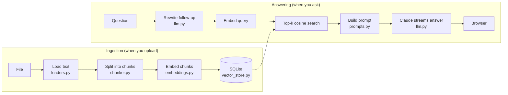

# KnowRAG AI

**Chat with your own documents.** KnowRAG AI is a complete, full-stack **Retrieval-Augmented Generation (RAG)** application. You upload PDFs, Word files, text or Markdown; it indexes them; and when you ask a question, it finds the most relevant passages and has **Claude** (Anthropic's generative AI model) write an answer grounded in those passages, with numbered citations you can check.

It was written to be **learned from**. Every line of source code carries a comment explaining what it does, and the [`docs/`](docs) folder explains the concepts and walks through each file.

| Layer | Technology | What it does |
|---|---|---|
| Frontend | React 19 + Vite | Upload panel, streaming chat UI, expandable source citations |
| Backend API | FastAPI (Python) | REST endpoints + Server-Sent Events streaming |
| Retrieval | FastEmbed (local embeddings) + SQLite + NumPy | Chunking, embedding, cosine-similarity search |
| Generation | Claude Opus 5.5 through the official `anthropic` SDK | Writes grounded, cited answers; rewrites follow-up questions |
| Deployment | Docker Compose + nginx | One command to run everything |

---

## Features

- **Multi-format ingestion**: PDF (with page numbers), DOCX (including tables), TXT and Markdown.
- **Semantic search**: local open-source embedding model (`BAAI/bge-small-en-v1.5`). It needs no GPU and no extra API key.
- **Grounded answers with citations**: Claude cites sources as `[1]`, `[2]`. The UI shows each cited chunk, its file and page, and its similarity score.
- **Live streaming**: answers appear token by token through Server-Sent Events. A **Stop** button cancels a running answer.
- **Conversational memory**: you can ask follow-ups like *"and the second one?"*. Before searching, Claude rewrites them into standalone queries.
- **Safety fallbacks**: if a request is declined by Claude's safety classifiers, it is retried automatically on Anthropic's recommended fallback model.
- **Prompt-injection hygiene**: retrieved text is clearly fenced and Claude is told to treat it as data, never as instructions. Markdown is rendered without raw HTML.
- **Offline mode**: `KNOWRAG_EMBEDDING_PROVIDER=hash` uses keyword vectors with no model download, which suits demos and tests.
- **Tested**: a 19-test pytest suite covers chunking, storage and search, and the full HTTP API (using a fake LLM, so tests are free and offline).

---

## How it works



1. **Retrieve**: the question is turned into a vector. The chunks whose vectors point in the most similar direction are fetched.
2. **Augment**: those chunks are inserted into the prompt as numbered `<source>` blocks.
3. **Generate**: Claude reads the sources and writes an answer that cites them.

Read [docs/01-rag-concepts.md](docs/01-rag-concepts.md) for a beginner-friendly explanation of each idea.

---

## Quick start

You need an **Anthropic API key** from <https://console.anthropic.com/>.

### Option A: Docker (simplest)

```bash
cp backend/.env.example backend/.env      # then edit backend/.env and paste your API key
docker compose up --build
```

- App: <http://localhost:8080>
- Interactive API docs: <http://localhost:8000/docs>

On first start the backend downloads the ~70 MB embedding model into a Docker volume. This can take a minute.

### Option B: Run locally (for development)

**Backend** (Python 3.10+):

```bash
cd backend
python -m venv .venv
source .venv/bin/activate                 # Windows: .venv\Scripts\activate
pip install -r requirements.txt
cp .env.example .env                      # then paste your API key into .env
uvicorn app.main:app --reload --port 8000
```

**Frontend** (Node.js 20.19+ or 22.12+), in a second terminal:

```bash
cd frontend
npm install
npm run dev
```

Open <http://localhost:5173>. The Vite dev server forwards `/api/*` calls to the backend on port 8000.

---

## Project structure

```
KnowRAG-AI/
├── backend/                     Python / FastAPI
│   ├── app/
│   │   ├── main.py              App factory: startup, CORS, routers, /api/health
│   │   ├── config.py            All settings (env vars with the KNOWRAG_ prefix)
│   │   ├── schemas.py           Pydantic request/response models
│   │   ├── api/
│   │   │   ├── deps.py          Dependency injection helper
│   │   │   ├── documents.py     Upload / list / delete endpoints
│   │   │   ├── search.py        Retrieval-only endpoint (debugging/learning)
│   │   │   └── chat.py          Streaming chat endpoint (SSE)
│   │   └── rag/
│   │       ├── loaders.py       File → text (PDF, DOCX, TXT, MD)
│   │       ├── chunker.py       Text → overlapping chunks
│   │       ├── embeddings.py    Chunks → vectors (FastEmbed or hashing)
│   │       ├── vector_store.py  SQLite storage + NumPy cosine search
│   │       ├── prompts.py       System prompts and prompt builders
│   │       ├── llm.py           Claude client: streaming, fallbacks, errors
│   │       └── pipeline.py      Orchestrates ingest() and answer()
│   ├── tests/                   pytest suite (fake LLM, offline embeddings)
│   ├── requirements.txt
│   ├── .env.example
│   └── Dockerfile
├── frontend/                    React / Vite
│   ├── src/
│   │   ├── main.jsx             Mounts <App/>
│   │   ├── App.jsx              Layout + shared document state
│   │   ├── api.js               fetch helpers + SSE stream parser
│   │   ├── styles.css           All styling (light + dark mode)
│   │   └── components/
│   │       ├── DocumentPanel.jsx  Drag-and-drop upload, document list
│   │       ├── ChatPanel.jsx      Conversation + streaming logic
│   │       ├── Message.jsx        One chat bubble (Markdown)
│   │       └── SourceList.jsx     Expandable citations
│   ├── vite.config.js
│   ├── nginx.conf               Production server config (SSE-friendly)
│   └── Dockerfile
├── docs/                        Concept guide + file-by-file walkthroughs
└── docker-compose.yml
```

---

## Configuration

All settings live in `backend/.env` (see [`backend/.env.example`](backend/.env.example)). App settings are prefixed with `KNOWRAG_` so they can't clash with other tools' environment variables.

| Variable | Default | Meaning |
|---|---|---|
| `ANTHROPIC_API_KEY` | (required) | Your Claude API key |
| `KNOWRAG_CLAUDE_MODEL` | `claude-opus-5-5` | Model that writes answers |
| `KNOWRAG_CLAUDE_EFFORT` | `medium` | Reasoning depth: `low`, `medium`, `high`, `xhigh`, `max` |
| `KNOWRAG_CLAUDE_MAX_TOKENS` | `64000` | Ceiling on generated tokens per answer |
| `KNOWRAG_CLAUDE_REFUSAL_FALLBACK` | `true` | Retry safety-declined requests on a fallback model |
| `KNOWRAG_QUERY_REWRITE` | `true` | Rewrite follow-up questions before searching |
| `KNOWRAG_EMBEDDING_PROVIDER` | `fastembed` | `fastembed` (semantic) or `hash` (offline keywords) |
| `KNOWRAG_EMBEDDING_MODEL` | `BAAI/bge-small-en-v1.5` | FastEmbed model name |
| `KNOWRAG_CHUNK_SIZE` | `1000` | Max characters per chunk |
| `KNOWRAG_CHUNK_OVERLAP` | `200` | Characters shared by neighbouring chunks |
| `KNOWRAG_TOP_K` | `5` | Chunks retrieved per question |
| `KNOWRAG_DATA_DIR` | `./data` | Where the SQLite DB and model cache live |
| `KNOWRAG_MAX_UPLOAD_MB` | `20` | Upload size limit |
| `KNOWRAG_CORS_ORIGINS` | `http://localhost:5173` | Comma-separated allowed browser origins |

> **Switching embedding provider or model?** Vectors from different models can't be compared. The app refuses to start if the stored index was built with another embedder. Delete the data folder and re-upload your files.

---

## API reference

| Method | Path | Body | Returns |
|---|---|---|---|
| `GET` | `/api/health` | – | `{status, model, embedding, documents}` |
| `POST` | `/api/documents` | multipart `file` | Document metadata (201) |
| `GET` | `/api/documents` | – | List of documents |
| `DELETE` | `/api/documents/{id}` | – | 204, or 404 if unknown |
| `POST` | `/api/search` | `{query, top_k?}` | Ranked chunks with similarity scores |
| `POST` | `/api/chat` | `{question, history?, top_k?}` | `text/event-stream` of `sources` → `token`… → `done` (or `error`) |

Try the chat stream from a terminal:

```bash
curl -N -X POST localhost:8000/api/chat -H 'Content-Type: application/json' \
     -d '{"question": "What are the key points?"}'
```

---

## Learning path: how to read the code

Every source file is commented line by line. A good reading order:

1. [docs/01-rag-concepts.md](docs/01-rag-concepts.md): what RAG is and why each step exists.
2. Backend, in data-flow order: `config.py` → `rag/loaders.py` → `rag/chunker.py` → `rag/embeddings.py` → `rag/vector_store.py` → `rag/prompts.py` → `rag/llm.py` → `rag/pipeline.py` → `api/*.py` → `main.py`. The companion guide is [docs/02-backend-walkthrough.md](docs/02-backend-walkthrough.md).
3. Frontend: `api.js` → `App.jsx` → `ChatPanel.jsx` → `Message.jsx` / `SourceList.jsx` / `DocumentPanel.jsx`. The companion guide is [docs/03-frontend-walkthrough.md](docs/03-frontend-walkthrough.md).
4. [docs/04-deployment-and-extending.md](docs/04-deployment-and-extending.md): Docker, production hardening, and ideas for next steps.

---

## Running the tests

```bash
cd backend
pytest -q
```

The tests use the offline `hash` embedder and a fake LLM. They need no API key, no network and no model download.

---

## Troubleshooting

| Symptom | Fix |
|---|---|
| "No Anthropic API key configured" in the chat | Put `ANTHROPIC_API_KEY=...` in `backend/.env` and restart the backend |
| "Cannot reach the backend" banner | Start the backend on port 8000 (or set `VITE_PROXY_TARGET` for `npm run dev`) |
| First start is slow / model download fails | The FastEmbed model is downloaded from Hugging Face once. Behind a firewall, use `KNOWRAG_EMBEDDING_PROVIDER=hash` |
| "No text could be extracted" | The PDF is a scanned image. Run OCR first (e.g. `ocrmypdf`) |
| Startup error about a different embedder | You changed embedding provider/model. Delete `backend/data/` and re-upload |
| Answers stream all at once behind a proxy | Disable response buffering for `/api/chat` (see `frontend/nginx.conf`) |
