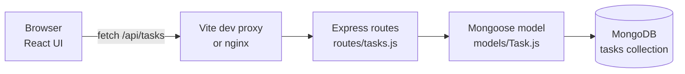

# MERN Tasks

A basic full-stack to-do app built on the **MERN** stack: **M**ongoDB, **E**xpress, **R**eact and **N**ode.js. You can add tasks, tick them off, rename them, delete them and filter the list. Everything is saved in MongoDB through a small REST API.

It is a starting point for learning: the code is short, every file is commented, and the API has a test suite.

| Layer | Technology | Where |
|---|---|---|
| Database | MongoDB 8 + Mongoose 9 (schema and validation) | `backend/src/models/` |
| API | Express 5 on Node.js 22 | `backend/src/` |
| UI | React 19, built and served in development by Vite 8 | `frontend/src/` |
| Deployment | Docker Compose + nginx | `docker-compose.yml` |

---

## How it fits together



1. **React** shows the tasks and calls the API with `fetch` (all calls live in `frontend/src/api.js`).
2. The browser only talks to **one origin**. In development the Vite dev server forwards `/api/*` to Express. In Docker, nginx does the same. So you don't have to set up CORS for either.
3. **Express** receives the request, checks the id, and asks the **Mongoose** model to read or write.
4. Mongoose validates the data against the schema and stores it in **MongoDB**.
5. Express sends JSON back, and React updates the screen.

---

## Quick start

You need **Node.js 22.12 or newer** and a **MongoDB** database. Pick one way to get MongoDB:

- **Docker:** run `docker compose up -d mongo` from this folder.
- **Local install:** [MongoDB Community Server](https://www.mongodb.com/try/download/community).
- **Cloud:** a free [MongoDB Atlas](https://www.mongodb.com/atlas) cluster. Put its connection string in `backend/.env`.

### Option A: run everything with Docker

```bash
cd mern-app
docker compose up --build
```

Open <http://localhost:3000>. The API is also exposed directly at <http://localhost:4000/api/tasks>.

### Option B: run locally (for development)

**Backend**, in one terminal:

```bash
cd mern-app/backend
npm install
cp .env.example .env        # optional: the defaults work with a local MongoDB
npm run dev                 # restarts automatically when you edit a file
```

You should see `Connected to MongoDB database "mern_tasks"` and `API listening on http://localhost:4000`.

**Frontend**, in a second terminal:

```bash
cd mern-app/frontend
npm install
npm run dev
```

Open <http://localhost:5173>.

---

## Project structure

```
mern-app/
├── backend/                       Node.js + Express + Mongoose
│   ├── src/
│   │   ├── index.js               Entry point: connect to MongoDB, start the server, clean shutdown
│   │   ├── app.js                 Builds the Express app: CORS, JSON parsing, routes, error handling
│   │   ├── config.js              Settings from environment variables / .env
│   │   ├── db.js                  Connect / disconnect / "is connected?" helpers
│   │   ├── models/Task.js         Mongoose schema: title (required, max 200 chars), completed, timestamps
│   │   ├── routes/tasks.js        REST endpoints for /api/tasks
│   │   └── middleware/errors.js   404 handler + turns every error into { "error": "..." }
│   ├── tests/tasks.test.js        API tests (node:test + Supertest + in-memory MongoDB)
│   ├── .env.example
│   └── Dockerfile
├── frontend/                      React + Vite
│   ├── src/
│   │   ├── main.jsx               Mounts <App /> into index.html
│   │   ├── App.jsx                Holds the task list; add / toggle / rename / delete / filter
│   │   ├── api.js                 fetch() helpers for every endpoint
│   │   ├── styles.css             All styling (light + dark mode, mobile friendly)
│   │   └── components/
│   │       ├── TaskForm.jsx       "What needs to be done?" input
│   │       ├── TaskList.jsx       The list, or an empty-state message
│   │       └── TaskItem.jsx       One task: checkbox, title, Edit / Delete
│   ├── vite.config.js             Dev server + /api proxy to port 4000
│   ├── nginx.conf                 Production server: static files + /api proxy
│   └── Dockerfile
└── docker-compose.yml             mongo + backend + frontend
```

A good reading order: `models/Task.js` → `routes/tasks.js` → `app.js` → `index.js`, then `api.js` → `App.jsx` → the components.

---

## API reference

All responses are JSON. Errors always have the form `{ "error": "message" }`.

| Method | Path | Body | Success | Errors |
|---|---|---|---|---|
| `GET` | `/api/health` | none | 200 `{status, database}` | 503 if MongoDB is down |
| `GET` | `/api/tasks` | none | 200, array of tasks (newest first) | none |
| `POST` | `/api/tasks` | `{ "title": "..." }` | 201, the new task | 400 if the title is missing, blank or too long |
| `GET` | `/api/tasks/:id` | none | 200, the task | 400 bad id, 404 unknown id |
| `PATCH` | `/api/tasks/:id` | `{ "title"?, "completed"? }` | 200, the updated task | 400 invalid data or id, 404 unknown id |
| `DELETE` | `/api/tasks/:id` | none | 204, no body | 400 bad id, 404 unknown id |

A task looks like this:

```json
{
  "_id": "66f1c2a9e4b0a1b2c3d4e5f6",
  "title": "Buy milk",
  "completed": false,
  "createdAt": "2026-10-08T12:00:00.000Z",
  "updatedAt": "2026-10-08T12:00:00.000Z"
}
```

Try it from a terminal while the backend is running:

```bash
curl -X POST localhost:4000/api/tasks -H 'Content-Type: application/json' -d '{"title": "Learn MERN"}'
curl localhost:4000/api/tasks
curl -X PATCH localhost:4000/api/tasks/<id> -H 'Content-Type: application/json' -d '{"completed": true}'
curl -X DELETE localhost:4000/api/tasks/<id>
```

---

## Configuration

The backend reads these environment variables. You can also put them in `backend/.env`; see [`backend/.env.example`](backend/.env.example).

| Variable | Default | Meaning |
|---|---|---|
| `PORT` | `4000` | Port the API listens on |
| `MONGODB_URI` | `mongodb://127.0.0.1:27017/mern_tasks` | MongoDB connection string |
| `CLIENT_ORIGIN` | `http://localhost:5173` | Comma-separated browser origins allowed by CORS |

The frontend reads two optional variables. `VITE_PROXY_TARGET` changes where `npm run dev` forwards `/api` (the default is `http://localhost:4000`). `VITE_API_URL` is applied at build time and makes the UI call an API on another domain.

---

## Running the tests

```bash
cd mern-app/backend
npm test
```

The 15 tests cover every endpoint, including validation and error cases. They start a throwaway MongoDB with [mongodb-memory-server](https://github.com/typegoose/mongodb-memory-server), so you don't need a database running. `npm install` downloads a MongoDB binary once and caches it for later test runs.

---

## Troubleshooting

| Symptom | Fix |
|---|---|
| Backend exits with "Could not connect to MongoDB at startup" | Start MongoDB (`docker compose up -d mongo`) or fix `MONGODB_URI` in `backend/.env` |
| UI shows "The server is unavailable… Is the backend running?" | Start the backend with `npm run dev` in `backend/` |
| `EADDRINUSE` when starting | Another program uses port 4000 (or 5173). Stop it or set `PORT` in `backend/.env` |
| `docker compose up` fails with "port 27017 is already allocated" | You already run MongoDB locally. Stop it, or remove the `ports:` lines from the `mongo` service |
| `npm run dev` in `frontend/` fails with a Node.js version error | Vite 8 needs Node.js 20.19+ or 22.12+. Run `node --version` and upgrade |

---

## Ideas for next steps

- Add user accounts (e.g. JWT auth) so each person sees only their own tasks.
- Add due dates or priorities: one new field in `models/Task.js`, then show it in `TaskItem.jsx`.
- Add pagination to `GET /api/tasks` for long lists.
- Add frontend tests with Vitest and React Testing Library.
